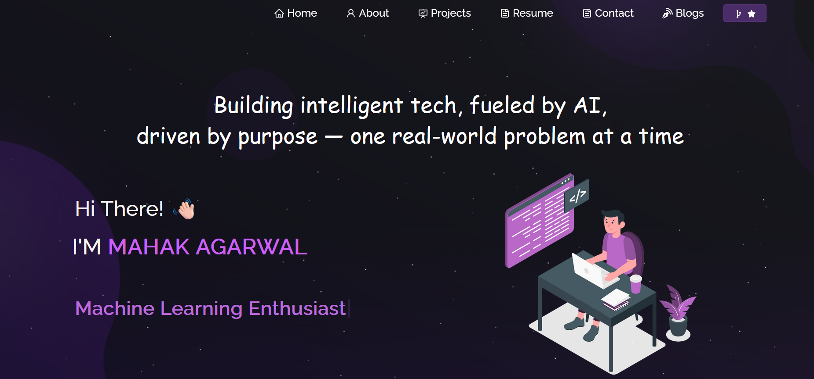

<<<<<<< HEAD
<h2 align="center">
  Portfolio Website 
  <a href="https://mahak.vercel.app/" target="_blank">Mahak.vercel.app</a>
</h2>

  

 

🌐 Personal Portfolio Website

This is a professional portfolio website built. It serves as an online resume showcasing my skills, projects, and contact details.

🎯 Task Objective

To create a responsive and elegant portfolio website with the following features:

- About Section – A brief introduction about myself.
- Skills Section – Highlights of both technical and non-technical skills.
- Projects Section – A collection of my top projects with descriptions and github links.
- Contact Form – A working contact form to allow users to reach out.
- Responsive Design – Optimized for all screen sizes (desktop, tablet, mobile).

💡 Features

- Multi-page layout
- Mobile-first responsive design
- Functional contact form
- Styled with CSS3 + Bootstrap/React-Bootstrap
- Smooth scrolling and interactive elements
- Project previews with GitHub links

🛠️ Tech Stack

- Frontend: React.js
- Styling: CSS3, React-Bootstrap
- Backend (Contact Form)
- Deployment: Vercel

🧑‍💻 How to Run This Project

1. Clone the Repository

git clone https://github.com/mahakagarwal45/Portfolio.git
cd Portfolio

2. Install Dependencies

npm install

3. Start the Development Server

npm start

Then open your browser and visit http://localhost:3000

✅ Evaluation Criteria Checklist

✔️ Functionality – All sections work and render as expected.  
✔️ Code Quality – Components are modular, readable, and well-commented.  
✔️ User Experience – Clean UI and fully responsive layout.  
✔️ Creativity – Custom UI styling and animations.  
✔️ Documentation – This README provides a clear overview and instructions.

📬 Contact

If you'd like to connect, feel free to reach out via the contact form on the site.

⭐ Show Your Support

If you found this helpful or liked the work, consider giving a star on the repo.
=======
# Portfolio
🚀 Personal Portfolio built with React.js showcasing my projects, resume, and skills. Includes PDF viewer, project links, and a responsive design with interactive UI. Deployed and mobile-friendly. ✨
>>>>>>> 5d867409630048e6be342c94607f96cdf9a436d6
